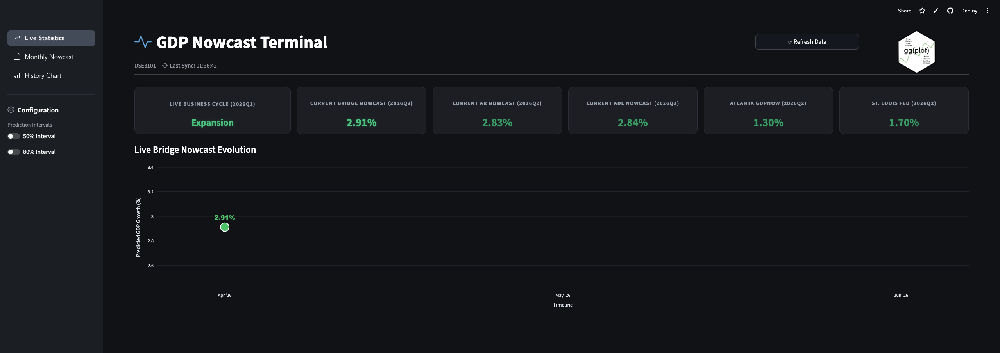

# DSE3101 gg(plot) 



[Dashboard (Streamlit App)](https://dse3101-proj-nncf8h3qkwgetp9nj6vzbc.streamlit.app/)

## Research Topic

**Nowcasting the economy:** This project serves to provide the nowcast for US GDP growth, as well as benchmark comparisons with industry models such as Atlanta's GDPNOW and St Louis Fed, through a clean and concise dashboard that is updated in real-time.

## Methodology

1. **Data preprocessing**
2. **Feature selection using LASSO**
3. **Bridge regression**
4. **Benchmark AR/ ADL/ RF models**
5. **Model Evaluation**
6. **Live Nowcasting**

## Dataset

- **FRED-MD**: Monthly macroeconomic dataset from the Federal Reserve bank of St. Louis
- **FRED-QD**: Quarterly macroeconomic dataset including real GDP
- **FRED-API**: Used for live nowcasting with the latest available monthly indicators and quarterly GDP

---

## Project Structure

```text
DSE3101-Proj/
├── .streamlit/                 # Streamlit theme and configuration
├── data/                       # Raw datasets, model predictions, and live API CSVs
├── figures/                    # Generated plots and visualizations
├── frontend/                   # Streamlit dashboard modules
│   ├── assets/                 # Static assets and images
│   ├── components/             # UI elements (biz cycle, live graphs, config panels)
│   ├── main.py                 # Frontend main layout logic and main entry point to run the Streamlit app
│   ├── utils.py                # Frontend helper functions
│   └── export_*.py             # Scripts for exporting historical data
├── models/                     # Saved model artifacts and weights
├── src/                        # Backend Data Science & ML Pipelines
│   ├── api_preprocessing.py    # Fetches and cleans live FRED data
│   ├── data_preprocessing.py   # Processes historical FRED-MD/QD datasets
│   ├── execution.py            # Model training and evaluation workflow
│   ├── feature_selection.py    # LASSO feature selection logic
│   ├── FRED_API_pipeline.py    # Core FRED API interaction functions
│   └── live_nowcast.py         # Live inference and prediction script
├── config.py                   # Global configuration and path settings
├── requirements.txt            # Python dependencies
└── README.md
```

--

## Tech Stack
1. **Frontend UI Tech Stack**
   **Core Framework:** Streamlit (Python)

   **UI Components & Navigation:** streamlit-option-menu for sidebar routing, native Streamlit layout containers (st.columns, st.sidebar, st.dialog).

   **Styling & Theming:** Custom CSS injections (for metric cards, hover states, and CSS keyframe animations) via st.markdown(unsafe_allow_html=True).

   **Iconography:** Bootstrap Icons (imported via CDN).

   **Frontend Architecture:** Modular, component-based design separating logical UI elements (e.g., biz_cycle.py, live_graph.py, config_panel.py) from the main execution script.

   **Data Interface Layer:** pandas and numpy for localized data transformation and cache management (@st.cache_data) before rendering.

   *Frontend Architecture Note: The dashboard leverages a component-based structure to maintain a clean main.py entry point. UI rendering is heavily customized using raw HTML/CSS injections to override Streamlit's default styling, enabling features like glowing text animations, custom KPI cards, and embedded Bootstrap iconography for a more polished "terminal" aesthetic.*

2. **Backend**

-- 

## Local Setup

1. **Create a Python virtual environment** (recommended):

   ```bash
   python -m venv .venv
   ```

2. **Activate the virtual environment**:
   - On macOS/Linux:
     ```bash
     source .venv/bin/activate
     ```
   - On Windows:
     ```bash
     .venv\Scripts\activate
     ```

3. **Install dependencies**:

   ```bash
   pip install -r requirements.txt
   ```

4. **FRED API Setup**
   1. Create a FRED account and request an API key at https://fred.stlouisfed.org/docs/api/fred/v2/api_key.html
   2. Set the API key as an enviroment variable
      - On macOS/Linux:
     ```bash
     export FRED_API_KEY = "your_api_key_here"
     ```
   - On Windows:
     ```bash
     $env:FRED_API_KEY="your_api_key_here"
     ```
   3. Check that your API key has been set
      - On macOS/Linux:
     ```bash
     echo $FRED_API_KEY
     ```
   - On Windows:
     ```bash
     echo $env:FRED_API_KEY
     ```
## Running files

The project has 3 main workflows:

1. **Backend Pipeline**
   ```bash
   python -m src.execution
   ```

2. **Live Nowcasting Pipeline**
   1. Fetch latest FRED data
      ```bash
      python -m src.api_preprocessing
      ```
   2. Run live nowcast
      ```bash
      python -m src.live_nowcast

3. **Frontend UI Dashboard**
   ```bash 
   streamlit run frontend/main.py
      ```

## Contributed By

1. Bryce Tan Jing Kai (A0272764W)
2. Chin Chen Shao Javier (A0272898E)
3. Gan Zhi Yu Charlene (A0282072J)
4. Melanie Tan Yong En (A0277113J)
5. Owen Lim Wen Xuan (A0272606E) 
6. Shannon Kwok En Yi (A0281617B)
7. Tan Sze Ping (A0286558J)
8. Vanisha Muthu (A0282716Y)